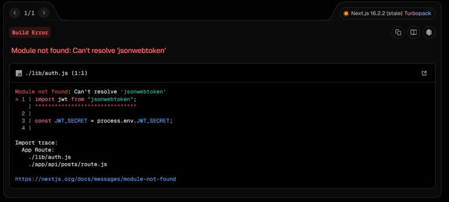
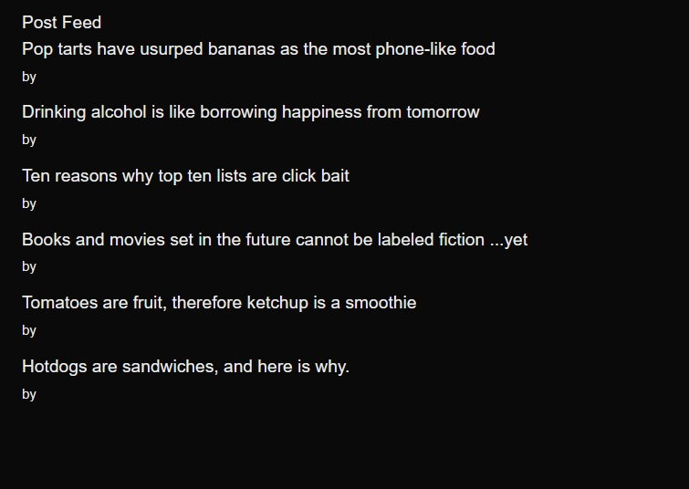
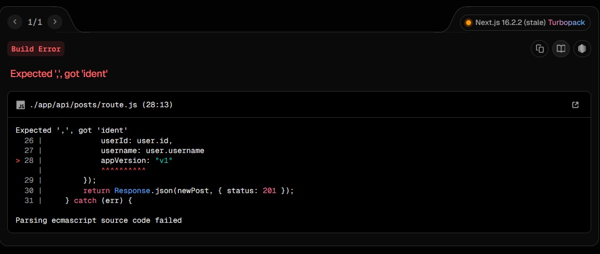
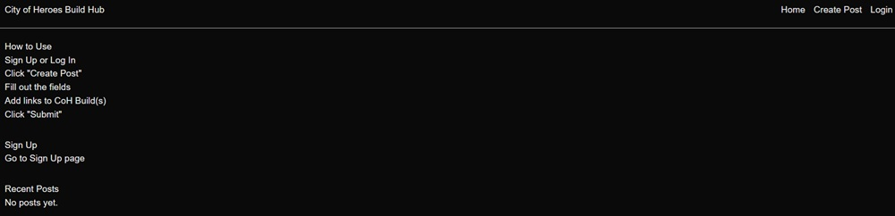
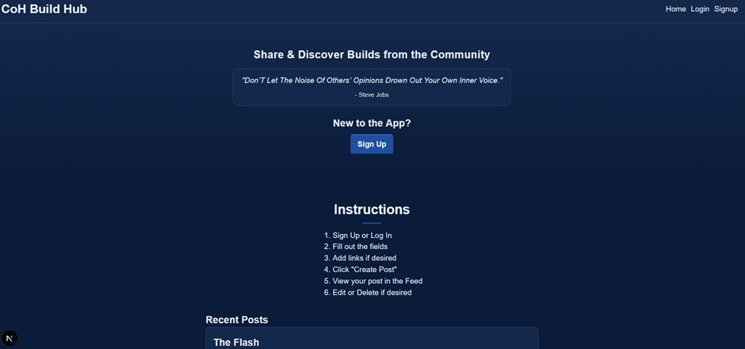
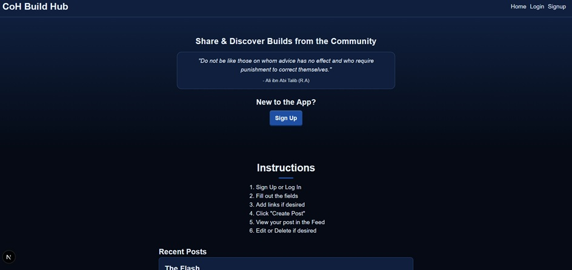
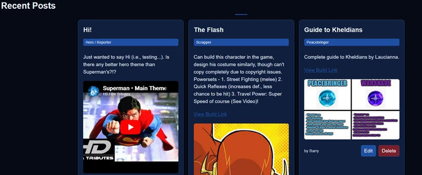
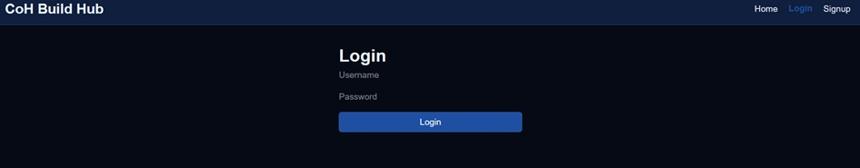
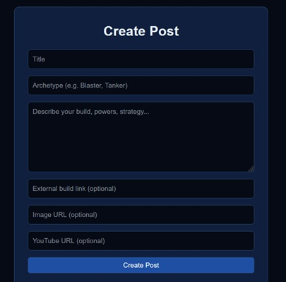

# COH-APP-ELSTON
> This Project is proprietary and not for public use.

## Overview
This is a full-stack web application built using **Next.js** and **MongoDB Atlas**.
It will allow users to create and manage posts through a custom API.

This project is for a course final and will evolve as it is being developed.

## Changelog

### [v0.1.0] 04/06/2026 - 04/08/2026
- Next.js initialized and cleaned.
- MongoDB Atlas setup (`/lib/mongodb.js`)
- Environment variables configured (`.env.local`).
- API route created: `/api/posts` (GET/POST ready).
- Frontend page created: `/create-post`.
- README formatted.

### [v0.1.1] 04/08/2026 - 04/09/2026
- MongoDB Atlas connected.
- `.env.local` updated.
- Initialized `User.js`: `username` and `passwordHash`.
- Setup Authentication APIs: `/api/auth/signup` and `/api/auth/login` with hashing and JWT tokens.
- Initialized signup page (incl. API call, alerts, redirect).

### [v0.1.2] 04/19/2026
- route.js updated.
- `.env.local` updated with JWT_SECRET.
- Created `/lib/auth.js`.
- `/app/api/posts/route.js` updated.
- `/app/create-post/page.jsx` created.
- Renamed `/app/page.tsx` to `/app/page.jsx`.
- Deleted boilerplate conent left over from `/app/page.tsx`.
- Coded for homepage / feed page.
- Tested, forgot to install jsonwebtoken.

- Installed jsonwebtoken.
- Tested.
- Homepage reflects data from prior assignment due to same MongoDB cluster used:

- Added filter-by-version to `/app/api/posts/route.js` and `/app/page.jsx`.

- Corrected missing comma typo in `/app/api/posts/route.js`.

- Homepage appears as intended!
- Updated homepage to basic: header w/ navbar, main w/ instructions, sign up prompt, and recent posts feed.

### [v0.1.3] 04/20/2026
- Created `/app/components/navbar.jsx`
- Removed static header for `<Navbar />`.
- Created conditional rendering between login and logout states.
- Created logout to clear localStorage and redirect to Home.
- Corrected numerous typos (ex. "header" vs. "headers").
- Updated login to store both token and username.
- Login now redirects for refresh (*Temporary for MVP. Will change back later if/when more developed*).
- Tested Signup. Failure! Forgot to install Bcryptjs.
- Installed Bcryptjs.
- Failed to login.
- Corrected `/app/api/auth/signup/route.js`:check for existing user, hash password, and save.
- Confirmed users pass thru signup, login, to create-post!
- Updated `/models/Post.js` and `/api/posts/route.js` to include: title, content, imageUrl, youtubeUrl, externalLink, and archetype.
- Fixed externalLink issues due to typo.
- Fixed post schema to store external links correctly.
- Updates post feed to better render cards and links.
- Created post delete option.
- Added auth check so only owners of posts can delete their posts, not others.
- Made use users can create, display, and delete posts fluidly.

### [v0.1.4] 04/21/2026 - 04/22/2026
- Re-did Navbar to persist across all pages.
- Fixed bug with Login/Logout Navbar link.
- Removed now-unecessary "Back to Home" button from Login, Create-Post, and Signup.
- Began applying CoH-inspired styling color theme.
- Began moving styling to global CSS for shared styles.
- Updated variables to use themes.
- Added editing to posts to complete CRUD operations.
- Made editing form appear at top of homepage rather than re-direct to separate page.
- Added editing button to posts.
- Added button effects.
- Added `https://dummyjson.com/quotes/random` third-party API per requirement to homepage.

## [v0.1.5] 04/22/2026
- Tweaked / corrected various style issues on home / feed page.
- Added hero banner section, applied linear gradient, to keep with theme and best practices.
- Re-arranged edit form, quote API, sign-up CTA, instructions.
- Tweaked sign-up CTA & perfected instructions.
- Customized further CSS variables.
- Migrated most inline styles to `/global.css`.
- Re-made post feed into grid.
- Styled feed cards.
- Added responsiveness for mobile, tablet, and desktop.
- Improved button styling for mobile.
- Made temporary favicon.
- Tested final build for submission.

## Tech Stack
- **Frontend:** Next.js (app router)
- **Backend:** Next.js API routes
- **Database:** MongoDB Atlas

## Features
- User authentication (login, register with JWT)
- Create, read, update, delete posts
- Protected API routes
- Navbar based on auth state
- External links, image, YouTube embedding in posts

## API
- POST `/api/posts` create post
- GET `/api/posts` fetch posts
- PUT `/api/posts` update/edit posts
- DELETE `/api/posts` delete post

## Screenshots
### Homepage

### Homepage (Dark Mode)

### Post Feed

### Login

###

## LICENSE
> This project is proprietary and not open for public use.  
See the LICENSE file for details.